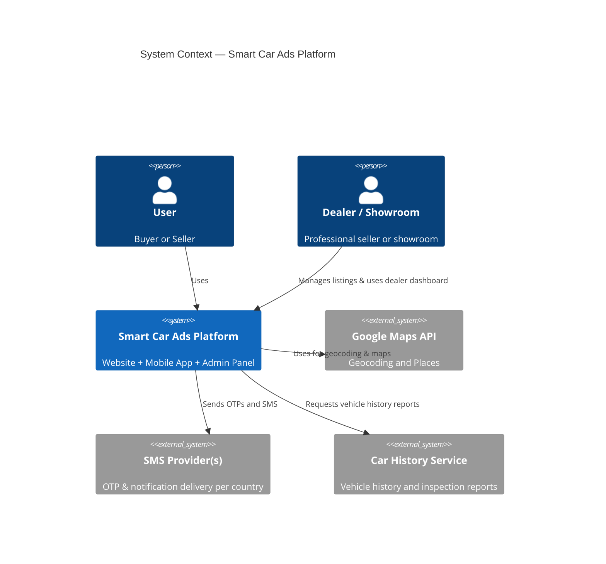
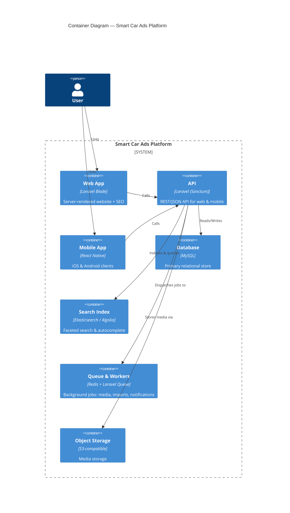

# C4 Model Overview — Smart Car Ads Platform

This document explains the C4 modelling approach for the Smart Car Ads Platform and includes four diagrams: System Context, Container, Component and Deployment. Diagrams are expressed using Mermaid's C4 syntax.

## About C4
- C4 provides 4 canonical views to describe software systems at different levels of abstraction:
  1. System Context — who uses the system and which external systems it interacts with.
 2. Container — major applications/services and how they communicate.
 3. Component — internal components of a container and responsibilities.
 4. Deployment — physical topology and runtime infrastructure.

---

## 1) System Context (C4Context)
Describes actors and external systems interacting with the Smart Car Ads Platform.



---

## 2) Container Diagram (C4Container)
Shows the main deployable applications and services.



---

## 3) Component Diagram (C4Component)
Details major components inside the API container.

```mermaid
C4Component
  title Component Diagram — API (Core Components)

  Container(api, "API", "Laravel API")

  Component(auth, "Auth Service", "Sanctum + OTP", "Registration, login, OTP verification, token management")
  Component(ads, "Ads Service", "Domain layer + controllers", "Ad creation, types, publishing, moderation")
  Component(media, "Media Service", "Workers + Processing", "Image/video processing, 360°, CDN integration")
  Component(searchComp, "Search Integration", "Indexer", "Indexes ads into Elasticsearch / Algolia")
  Component(payments, "Payments Service", "Gateway adapters", "Subscriptions and transactions")
  Component(notify, "Notification Service", "Push/SMS/Email", "User notifications and alerts")

  Rel(auth, db, "Reads/Writes users & tokens")
  Rel(ads, db, "Reads/Writes ad records")
  Rel(media, storage, "Writes media files")
  Rel(ads, media, "Requests uploads & thumbnails")
  Rel(ads, searchComp, "Requests indexing on publish")
  Rel(payments, db, "Persists transactions")
  Rel(notify, smsProvider, "Sends SMS via")

```

---

## 4) Deployment Diagram (C4Deployment)
Illustrates the runtime topology (example production layout).

```mermaid
C4Deployment
  title Deployment Diagram — Production (example)

  Deployment_Node(kvm, "KVM4 Cluster", "KVM hosts") {
    Deployment_Node(appTier, "App Servers", "Docker, PHP-FPM, Nginx") {
      Container(apiInstance, "Laravel API", "Docker / PHP-FPM", "API container")
      Container(webInstance, "Laravel Web", "Docker / PHP-FPM", "Web container")
    }
    Deployment_Node(workerTier, "Worker Nodes", "Queue workers") {
      Container(worker1, "Worker", "PHP CLI", "Queue worker instance")
    }
    Deployment_Node(dbTier, "Database Servers", "MySQL Primary + Replica") {
      Container(mysqlPrimary, "MySQL Primary", "MySQL", "Primary DB")
    }
    Deployment_Node(storage, "Object Storage", "S3-compatible") {
      Container(storageInstance, "Object Storage", "S3-compatible", "Media store")
    }
    Deployment_Node(cdn, "CDN", "Edge CDN") {
      Container(cdnInstance, "CDN", "CDN", "Edge CDN")
    }
  }

  System_Ext(smsProvider, "SMS Provider(s)", "Per-country SMS API")
  System_Ext(googleMaps, "Google Maps API", "Geocoding & Places")

  Rel(apiInstance, mysqlPrimary, "Reads/Writes")
  Rel(webInstance, storage, "Serves media via CDN")
  Rel(apiInstance, smsProvider, "Sends OTP/SMS")
  Rel(apiInstance, googleMaps, "Uses for geocoding")

```

---

If you want, I can:
- produce an ER diagram derived from the entities, or
- export these diagrams as PNG/SVG files, or
- convert them to PlantUML if you prefer.
